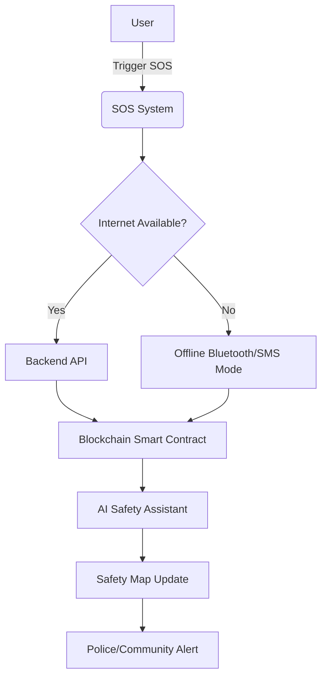

# 🔐 Nirbhay India  
### Empowering Safety Through Technology  

Nirbhay India is an innovative safety-focused project designed to ensure **real-time protection and support** for individuals in emergency situations.  
The system integrates **AI, IoT, and Blockchain** technologies to provide **secure communication, live tracking, and smart alerts**.

---

## 🚀 Features

- 🧠 **AI-based Threat Detection** – Predicts and detects unusual or risky situations using trained models.  
- 🌐 **Blockchain Integration** – Ensures secure, tamper-proof communication and data transfer.  
- 📍 **Live Location Tracking** – Real-time GPS tracking for user safety and alerts to emergency contacts.  
- 📡 **IoT Device Connectivity** – Works seamlessly with wearable devices and sensors.  
- 🔔 **Instant Alerts** – Sends emergency notifications to trusted contacts and local authorities.  
- 📊 **Data Analytics Dashboard** – Monitors, visualizes, and analyses safety data trends.  
- 🧩 **Offline Mode** – Operates even with limited internet access.

---

## 🧱 System Architecture

| Layer | Technology Stack |
|-------|-------------------|
| **Frontend** | HTML, CSS, JavaScript, React.js |
| **Backend** | FastAPI, Flask |
| **AI/ML** | Python, TensorFlow, Scikit-learn |
| **Blockchain** | Ethereum, Solidity, Web3.js |
| **IoT Integration** | MQTT Protocols |
| **Database** | MongoDB / Firebase |
| **Design Tools** | Figma, Canva |

---

## 👥 Team Members

| **Name** | **Role** | **LinkedIn** |
|-----------|-----------|--------------|
| **Rishabh Jain** | Team Lead, AI Developer | [linkedin.com/in/rishabh-jain2005](https://linkedin.com/in/rishabh-jain2005) |
| **Yashvika Bhardwaj** | Research & Blockchain Integration | [linkedin.com/in/yashvika-bhardwaj-08b500351](https://www.linkedin.com/in/yashvika-bhardwaj-08b500351/) |
| **Team Nirbhay India** | Frontend, IoT, and Data Analysis | [linkedin.com/in/nirbhay-india-aa31bb375](https://www.linkedin.com/in/nirbhay-india-aa31bb375/) |

---

## 🧩 Modules

| Module | Description |
|--------|-------------|
| **Auth** | User registration, login, fingerprint & face authentication |
| **Safety Map** | Displays categorized safe/unsafe zones |
| **Chatbot** | AI-driven emergency guidance assistant |
| **Blockchain Log** | Immutable record of alerts and responses |
| **Device Sync** | Connects panic wearable via Bluetooth |
| **Offline Cache** | Local data access without internet |

---

## 🧠 Future Enhancements

- 🧍‍♀️ **Voice-activated distress signal**  
- 🛰️ **Drone support for rapid police response**  
- 💬 **Multi-language AI chatbot**  
- 💰 **Blockchain reward system** for responders  
- 📶 **5G IoT wearable panic button**  

---

## 🛡️ License

This project is licensed under the **MIT License** — see the [LICENSE](LICENSE) file for details.

---

## ❤️ Acknowledgments

- 👩‍💻 Women’s Safety Survey Respondents (Google Form Data)  
- 🤖 OpenAI & Gemini API for AI integration  
- ⛓️ Polygon Network for blockchain layer  
- 🎓 TMU Hackathon mentors and supporters  

---

## 📊 Visual Flow Diagram (Markdown)

### Developed with ❤️ by Team Nirbhay India
Because feeling safe is not a privilege — it’s a right.
